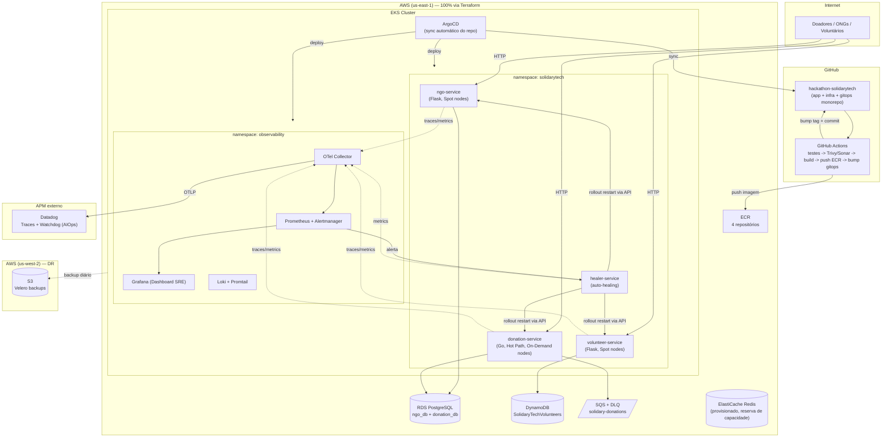

# Arquitetura — SolidaryTech (Hackathon Fase 5)

## 1. Visão geral



## 2. Princípios de arquitetura seguidos

1. **Regra de ouro (nada manual)**: todo recurso AWS nasce do Terraform
   (`infra/`); todo objeto Kubernetes de workload nasce do ArgoCD lendo `solidarytech-gitops/` — a única
   exceção documentada é o bootstrap inicial do próprio ArgoCD, que também é aplicado pelo
   Terraform (`infra/modules/argocd`), nunca por um humano digitando `kubectl apply`.
2. **Separação de responsabilidade Terraform vs. GitOps**: Terraform possui os recursos que
   "sabem segredos" (RDS, senhas, endpoints) e os injeta como Kubernetes Secrets; GitOps
   possui só a definição dos workloads, referenciando os Secrets pelo nome — nenhuma
   credencial é commitada no Git (ver `infra/envs/production/main.tf`).
3. **Hot Path isolado**: `donation-service` roda em node group `ON_DEMAND` dedicado (mais
   estável), tem `PodDisruptionBudget`, mais réplicas mínimas, HPA mais agressivo no scale-up
   e é o único serviço com SLI/SLO/SLA formal.
4. **AWS Academy-aware**: nenhum módulo Terraform tenta criar IAM roles/policies/OIDC
   provider — tudo usa a `LabRole` pré-existente.
5. **Observabilidade em duas camadas**: OSS (Prometheus/Grafana/Loki, sempre ativo, sem
   depender de conta externa) + APM comercial (Datadog/New Relic, para Distributed Tracing e
   AIOps) — o cluster fica plenamente observável mesmo antes/sem a conta de APM configurada.

## 3. Mapa de diretórios

```text
hackathon-solidarytech/
├── apps/                    # código-fonte dos 4 serviços (3 do enunciado + healer-service)
│   ├── ngo-service/          # Python/Flask — corrigido, instrumentado, Dockerfile distroless
│   ├── donation-service/     # Go — instrumentado, DLQ, retry, Dockerfile distroless
│   ├── volunteer-service/    # Python/Flask — bug corrigido, instrumentado
│   └── healer-service/       # Python/Flask — auto-healing in-cluster
├── infra/                   # Terraform (Frente 0 — IaC)
│   ├── bootstrap/            # backend remoto (S3+DynamoDB), aplicado 1x
│   ├── modules/               # vpc, eks, rds, sqs, dynamodb, redis, ecr, tags, argocd, velero-backend
│   └── envs/production/      # root module, wiring de tudo
├── gitops/                  # ArgoCD + manifests (Frente 0 — GitOps)
│   ├── argocd/apps/          # Applications (app-of-apps)
│   ├── apps/                  # Deployment/Service/HPA/PDB/ServiceMonitor por serviço
│   ├── observability/         # values do Prometheus/Loki, OTel Collector, dashboards, SLO rules
│   └── velero/                 # values do Velero (DR)
├── .github/workflows/       # CI/CD DevSecOps (Frente 0)
├── scripts/                  # k6 (carga) + chaos test (self-healing) + ambiente local
├── docker-compose.yml        # ambiente local completo, sem depender de AWS
└── docs/                     # SRE, FinOps, PCN/DR, ITSM/AIOps, roteiro do vídeo, runbook
```
