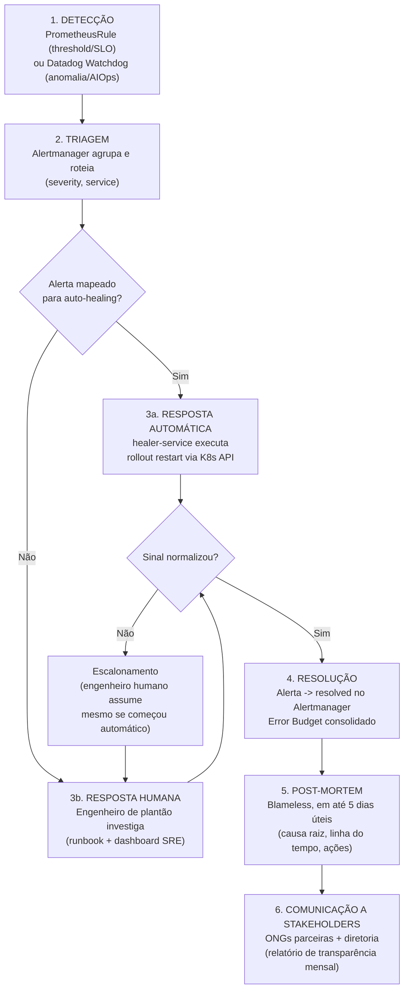

# ITSM/AIOps - Gestão Preditiva de Incidentes

> Seção obrigatória do Relatório de Entrega (PDF), item "Seção ITSM/AIOps".

## 1. AIOps - detecção automática de anomalias

**Ferramenta**: Datadog Watchdog.

**Como é alimentado**: o OTel Collector (`solidarytech-gitops/observability/otel-collector`) exporta
traces e métricas dos 3 serviços + healer-service para o Datadog via exporter nativo
(`solidarytech-gitops/observability/otel-collector/configmap.yaml`). O Watchdog precisa de:
1. Traffic real ou simulado rodando por um período (`scripts/load-test-donation-service.js`)
   para aprender a linha de base "normal" de latência/erro/tráfego por serviço.
2. Tempo - o Watchdog do Datadog tipicamente precisa de alguns dias de dado histórico para
   detecção de anomalia com confiança razoável; para o vídeo de demonstração, o k6 gera picos
   artificiais (`pico_viral` scenario) que o Watchdog consegue sinalizar mesmo com pouco
   histórico, por serem outliers estatísticos claros.

**O que o Watchdog detecta aqui**: desvios de padrão em latência/taxa de erro do
`donation-service` que não necessariamente cruzam o threshold fixo do SLO (que é reativo) -
é a camada **preditiva** complementar aos alertas de `PrometheusRule` (que são reativos/
threshold-based). Os dois se complementam: PrometheusRule cobre "sei exatamente o limite
aceitável" (SLO), Watchdog cobre "isso está diferente do normal, mesmo sem eu ter definido um
threshold para isso".

## 2. Fluxo de vida de um incidente da SolidaryTech

## 3. Detalhamento de cada etapa

1. **Detecção**: dois caminhos independentes e complementares - `PrometheusRule` (regras
   explícitas de SLO, ver `solidarytech-gitops/observability/extras/slo-donation-service.yaml`) e Datadog
   Watchdog (anomalia estatística, sem regra explícita). Cobrir os dois evita o ponto cego
   clássico de só ter alertas reativos.
2. **Triagem**: Alertmanager agrupa por `alertname`/`service` (evita tempestade de alertas
   duplicados) e roteia por `severity` - `critical` vai para o canal de stakeholders, alertas
   mapeados no `healer-service` dão início à resposta automática em paralelo.
3. **Resposta**:
   - **Automática**: só para os alertas explicitamente mapeados em
     `apps/healer-service/app.py` (`ALERT_TO_DEPLOYMENT`) - escopo deliberadamente restrito
     (crash loop, erro alto, latência alta no `donation-service` e crash loop nos outros 2
     serviços). Qualquer coisa fora desse mapa cai direto para resposta humana.
   - **Humana**: engenheiro de plantão usa o Dashboard SRE
     (`docs/SRE-SLI-SLO-SLA.md`, seção 6) e os traces distribuídos no APM para localizar a
     causa raiz.
4. **Resolução**: confirmada quando a métrica correspondente volta a ficar dentro do SLO por
   tempo suficiente para o Alertmanager marcar o alerta como `resolved`.
5. **Post-Mortem**: blameless (foco em processo/sistema, não em pessoa), publicado em até 5
   dias úteis conforme compromisso do SLA (`docs/SRE-SLI-SLO-SLA.md`, seção 5). Contém: linha
   do tempo, causa raiz, impacto (Error Budget consumido), ações de melhoria com dono e prazo.
6. **Comunicação a stakeholders**: ONGs parceiras recebem o resumo no relatório de
   transparência mensal (compromisso do SLA); incidentes `critical` também disparam
   notificação no canal configurado em `receivers.stakeholders`
   (`solidarytech-gitops/observability/kube-prometheus-stack-values.yaml`) no momento da detecção, não só
   depois do post-mortem - transparência em tempo real é parte da proposta de valor da
   SolidaryTech para as ONGs parceiras.

## 4. Por que isso reduz o MTTR (ligação com `docs/SRE-SLI-SLO-SLA.md`)

A etapa que mais demora no fluxo manual é "Detecção humana → Triagem manual" (alguém precisa
notar o problema, entender do que se trata, decidir o que fazer). Automatizar a Detecção
(AIOps + PrometheusRule) e a Resposta (healer-service) para o subconjunto de incidentes mais
comuns/mecânicos (crash loop, erro alto, latência alta) remove justamente a parte mais lenta
do processo para esses casos - ver comparação quantitativa de MTTR na seção 7 daquele
documento.
